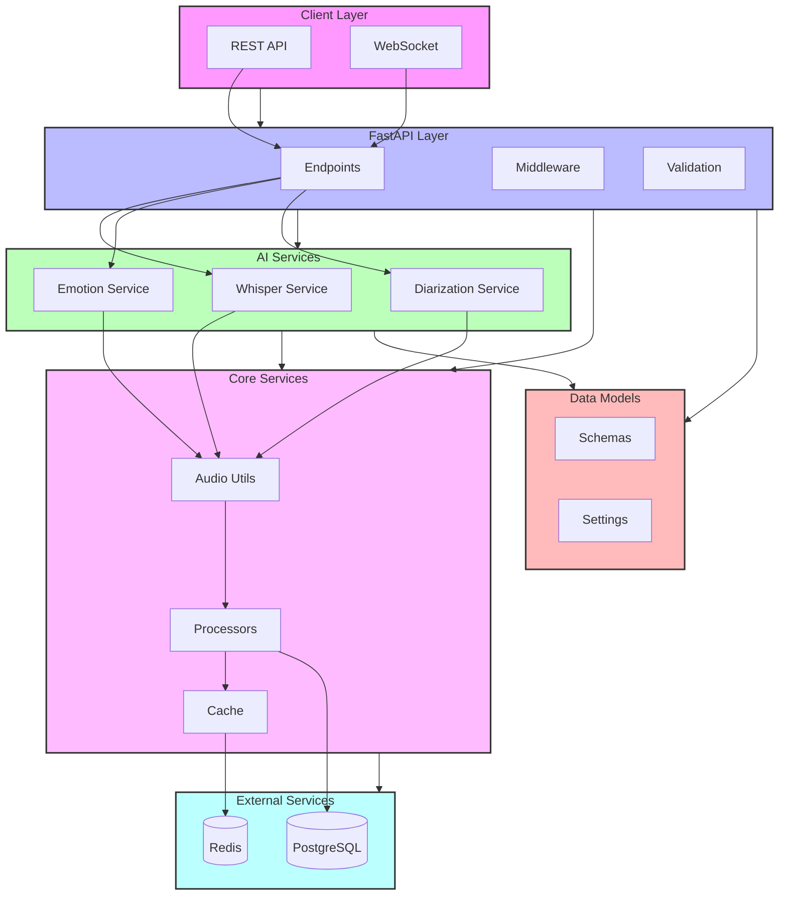

# Voice Analytics Python Backend

## Architecture Overview



## Project Structure

```
python-backend/
├── voice_analytics/
│   ├── __init__.py
│   ├── main.py                 # Application entry point
│   ├── api/
│   │   ├── __init__.py
│   │   ├── routes.py          # API routes
│   │   └── endpoints/         # API endpoints
│   ├── core/
│   │   ├── __init__.py
│   │   ├── settings.py        # Configuration
│   │   └── logging.py         # Logging setup
│   ├── models/
│   │   ├── __init__.py
│   │   └── schemas.py         # Pydantic models
│   └── services/
│       ├── __init__.py
│       ├── whisper.py         # Speech-to-text
│       ├── emotion.py         # Emotion analysis
│       └── diarization.py     # Speaker diarization
├── tests/
│   └── ...
├── pyproject.toml             # Dependencies
└── README.md
```

## Features

- **Speech Recognition**: Using Whisper AI
- **Emotion Analysis**: Using wav2vec2 models
- **Speaker Diarization**: Using SpeechBrain
- **Real-time Processing**: Async audio processing
- **API Documentation**: Swagger/OpenAPI
- **Monitoring**: Prometheus metrics

## Prerequisites

- Python 3.10+
- Poetry
- Docker & Docker Compose (for development)

## Quick Start

1. Install Poetry:
```bash
curl -sSL https://install.python-poetry.org | python3 -
```

2. Install dependencies:
```bash
poetry install
```

3. Set up environment variables:
```bash
cp .env.example .env
# Edit .env with your configuration
```

4. Run development server:
```bash
poetry run dev
```

5. Run production server:
```bash
poetry run start
```

## API Documentation

Swagger UI is available at: `http://localhost:6500/docs`
ReDoc is available at: `http://localhost:6500/redoc`

## Development

1. Start development databases:
```bash
./dev.sh start
```

2. Run with hot reload:
```bash
poetry run dev
```

3. Run tests:
```bash
poetry run pytest
```

4. Format code:
```bash
poetry run black .
poetry run isort .
```

5. Type checking:
```bash
poetry run mypy .
```

## Environment Variables

| Variable | Description | Default |
|----------|-------------|---------|
| PORT | Server port | 6500 |
| WORKERS | Number of workers | 4 |
| DEBUG | Debug mode | False |
| WHISPER_MODEL | Whisper model size | base |
| MAX_AUDIO_LENGTH | Max audio length (seconds) | 300 |
| SAMPLE_RATE | Audio sample rate | 16000 |

## Adding Swagger Documentation

1. Add FastAPI route documentation:
```python
from fastapi import APIRouter, File, UploadFile
from voice_analytics.models.schemas import AudioResponse

router = APIRouter()

@router.post("/audio/analyze", 
    response_model=AudioResponse,
    summary="Analyze audio file",
    description="Process audio file and return analysis results",
    responses={
        200: {"description": "Successful analysis"},
        400: {"description": "Invalid audio file"},
        500: {"description": "Processing error"}
    })
async def analyze_audio(
    file: UploadFile = File(..., description="Audio file to analyze")
) -> AudioResponse:
    ...
```

2. Add model documentation:
```python
from pydantic import BaseModel, Field

class AudioResponse(BaseModel):
    """Audio analysis response model."""
    
    transcription: str = Field(
        ...,
        description="Transcribed text",
        example="Hello, world!"
    )
    emotions: List[str] = Field(
        ...,
        description="Detected emotions",
        example=["happy", "neutral"]
    )
```

## Monitoring

- Prometheus metrics: `http://localhost:6500/metrics`
- Health check: `http://localhost:6500/health`

## Error Handling

The application uses structured error responses:
```json
{
    "error": "ValidationError",
    "message": "Invalid audio format",
    "details": {
        "format": "Only WAV, MP3, and FLAC are supported"
    }
}
```

## Performance Optimization

1. **Caching**:
   - Redis for processed results
   - In-memory LRU cache for frequent requests

2. **Processing**:
   - Chunked audio processing
   - Parallel AI model inference
   - Batch processing where applicable

## Contributing

1. Fork the repository
2. Create a feature branch
3. Commit your changes
4. Push to the branch
5. Create a Pull Request 